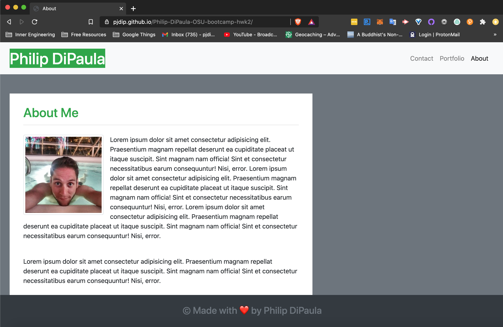

# Philip-DiPaula-OSU-bootcamp-hwk2

## These are the files for the second OSU Web Development Bootcamp Homework Assignment

Here is a [link](https://pjdip.github.io/Portfolio/) to the live page :D

The goal of this assignment was to learn how to use the Bootstrap CSS Framework to create a mobile responsive portfolio. In addition, we wanted to build upon the things we have learned already, such as accessibility standards and semantic html.

* [Installation](#installation)
* [Usage](#usage)
* [Credits](#credits)
* [Badges](#badges)
* [License](#license)

## Installation

The only thing you will need to have installed in order to run the index.html file is a functioning web browser. It should work with most versions of most browswers. I recommend the Brave browser, as you will be paid in the Basic Attention Token (BAT) for viewing ads, instead of being bombarded with ads and getting nothing for it.

## Usage 

In order to use this project, simply open the index.html in your favorite browser or open the link provided above. You will find a navbar in the upper right-hand corner which will redirect you to the various parts of the page. This includes an about me, an image gallery, and an as yet non-functioning form for reaching out to me with any questions or comments that you may have. The form will be made to function once we develop our javascript skills. The images in the gallery can be clicked on to open the full size image in a separate tab. The navbar will highlight which part of the page you are on by making that section bold. More will be added to the page in time.

Here are a few images of the page (notice the navbar indicating which section you are currently in):

## Credits

Special thanks to Bootstrap [Documentation](https://getbootstrap.com/docs/4.5/getting-started/introduction/) 

Thanks to Mozilla Developer Network for a little clarification on [semantic](https://developer.mozilla.org/en-US/docs/Glossary/Semantics) elements and understanding [accessibility](https://developer.mozilla.org/en-US/docs/Learn/Tools_and_testing/Cross_browser_testing/Accessibility)

Thanks to w3schools for information about [meta tags](https://www.w3schools.com/tags/tag_meta.asp)

Thanks to [W3](https://validator.w3.org/) markup validation service for help with debugging

Special Thanks to [ChilledCow](https://www.youtube.com/channel/UCSJ4gkVC6NrvII8umztf0Ow) for providing chill lofi beats to code to

## Badges

## License

Licensed under the [GNU General Public License v3.0](https://choosealicense.com/licenses/gpl-3.0/)

---